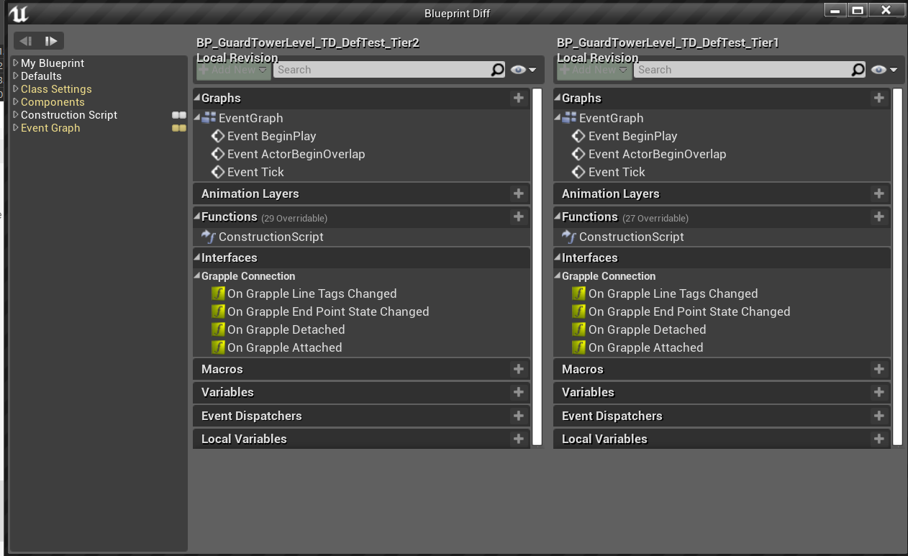
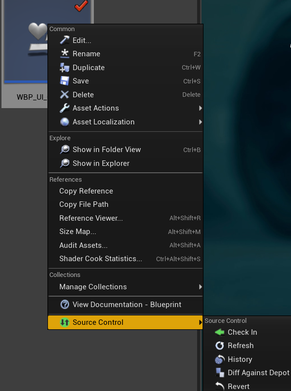
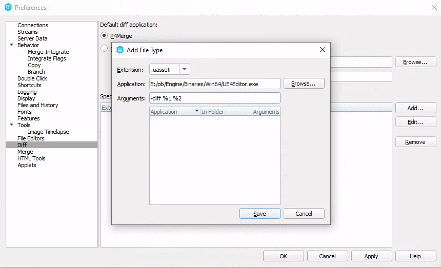
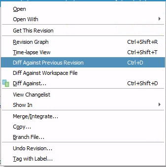

# Diff tools

## Diff Blueprints

### In Editor

* In editor you can diff by right clicking the Blueprint and clicking `Diff Against Depot` 
  

### External Diff

* You can only diff in editor, however you can setup an external VCS tool to call the editor up to diff blueprints.

### Perforce

* In preferences you can setup up the application to call based on the file extension. After which you can diff against previous revision.

