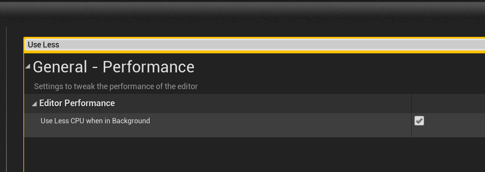

# Unreal Editor

## Settings to note

* Full performance when not in focus. - use less cpu
  * Useful most of the time, but at times a killer, find it in `Editor Preferences -> Miscellaneous -> Use Less CPU when in background`
  * 
