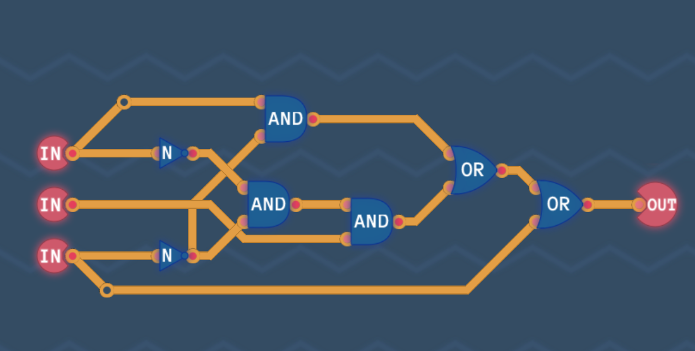

# Notes For Monday, October 18th 2021

* \#TuringComplete
  * Found an early access game (Written in #GoDot) Which allows you to build computers starting at the Logic Gate level, building into a computer and finally creating an assembly language for the machine you create.
  * Still on the basic logic gates but have already learned something new and felt the excitment of putting it into practice
    -[karnaugh-maps](../knowledge/electronics/karnaugh-maps.md) - A Method of working out the Sum Of Products Simplified form for Boolean Expressions. Was pretty exciting learning this and implimenting it in my first try. 
    
