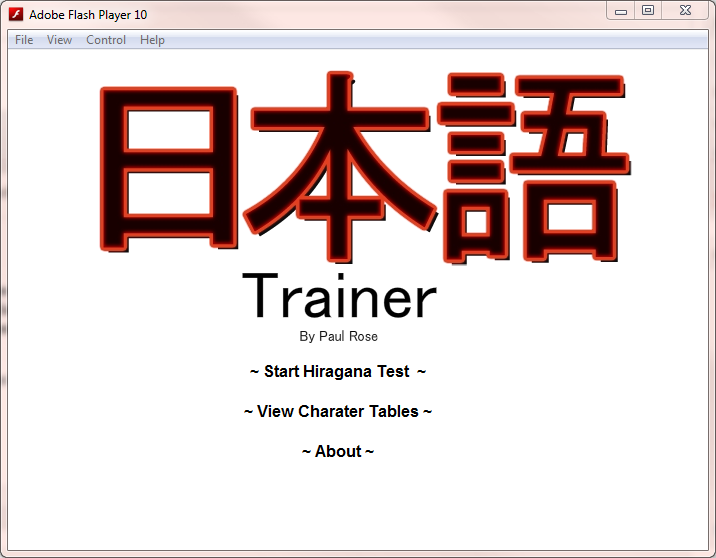
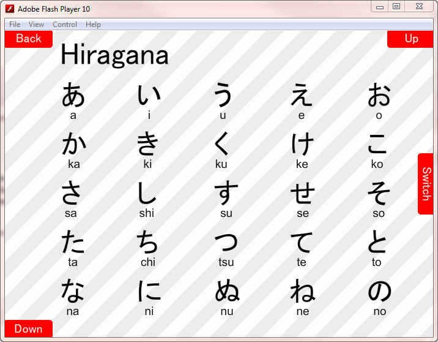
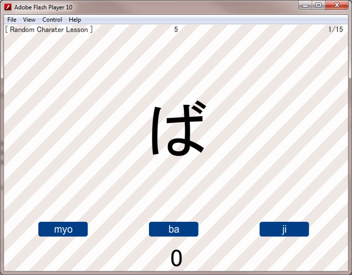

I took a couple of Japanese modules at university and I happen to like programming. So I decided to help myself out and write a Flash game to help me learn!

Written using Adobe Flash and ActionScript 3, this small program will take you through a quiz of Hiragana and Katakana with the parameters you define.

If you still have flash installed have a go! There are some more screen shots below otherwise!

[japlesson.swf](assets/japlesson.swf)
[Source available on Github](https://github.com/niko-niko/japanesetrainer)

