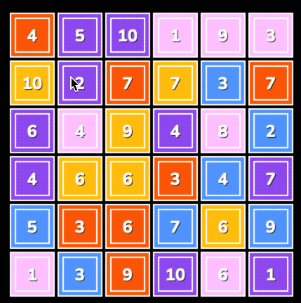
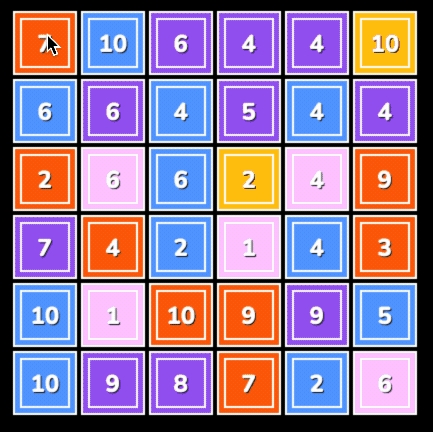

Numbers is  small game, where you attempt to reach the target number by adding or subtracing a combination of numbers to reach it. 

Here is a gif showing selection and deselction of tiles, as well as selection incorrect ones.

Here is another gif showing aceptting a selection

